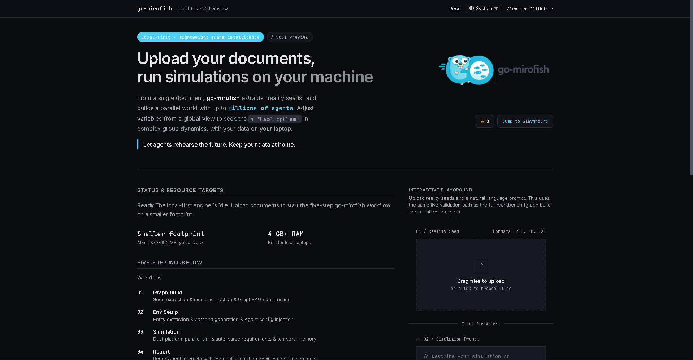
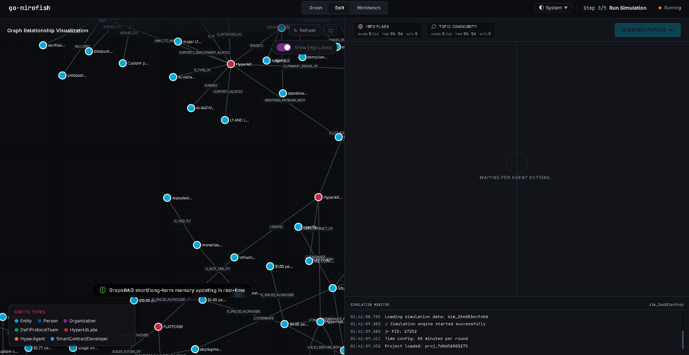
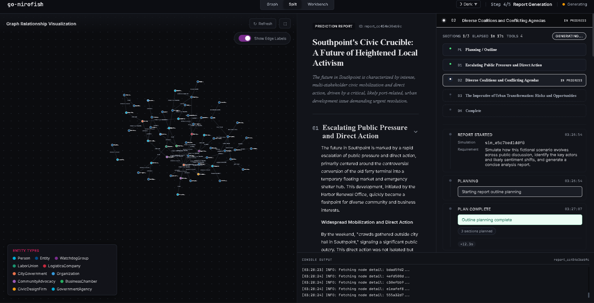
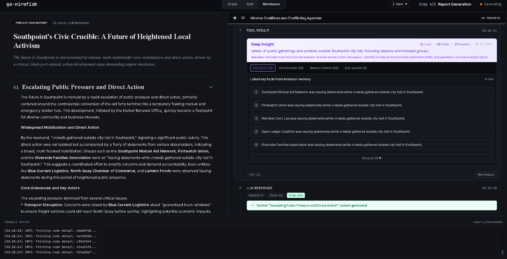
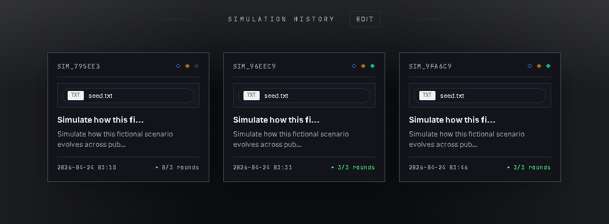
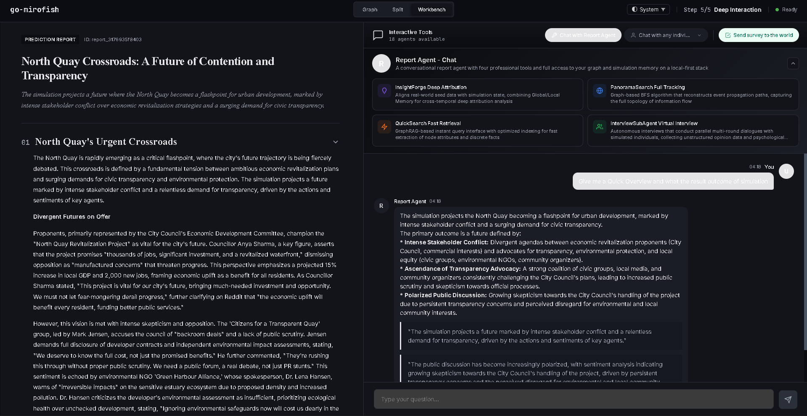
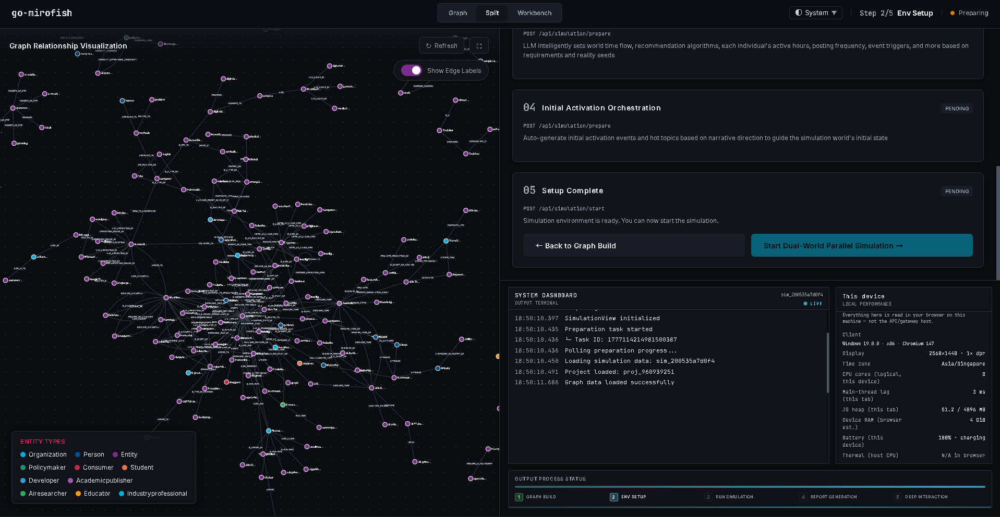
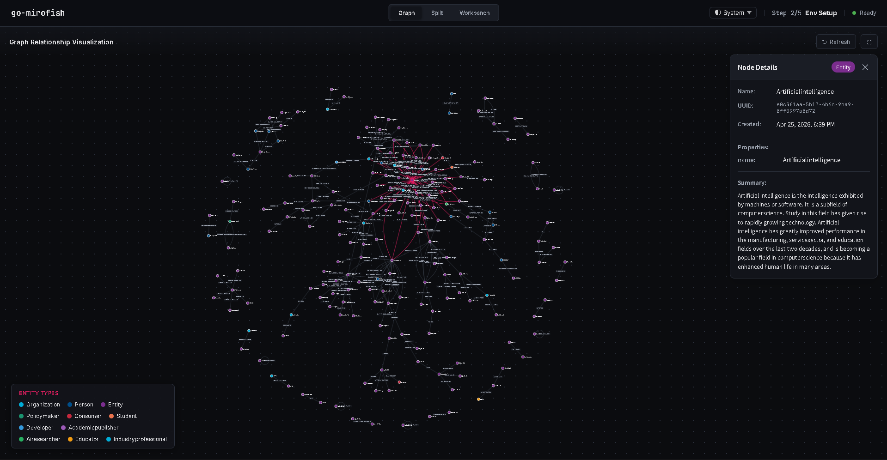
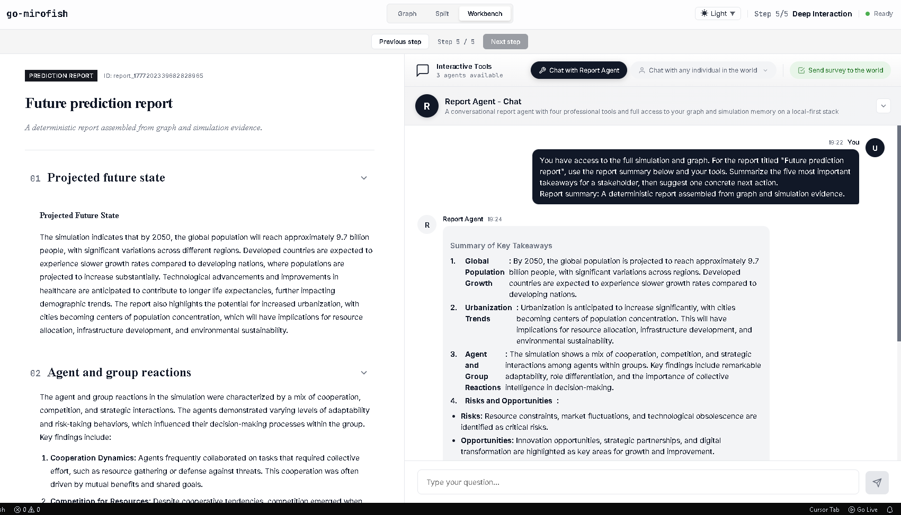

<div align="center">


**go-mirofish, lightweight and local-first**

[](https://github.com/go-mirofish/go-mirofish/stargazers)
[](./LICENSE)
[](https://go.dev/)
[](https://github.com/sponsors/go-mirofish)
[](https://www.buymeacoffee.com/justinedevs)
[](https://x.com/trader2g)
<a href="https://www.producthunt.com/products/go-mirofish?embed=true&amp;utm_source=badge-featured&amp;utm_medium=badge&amp;utm_campaign=badge-go-mirofish" target="_blank" rel="noopener noreferrer"></a>
Upload documents, describe what you want to predict, and get a full simulation report **on your laptop**.

</div>

**Public preview (Vercel):** [go-mirofish.vercel.app](https://go-mirofish.vercel.app). Custom domain **go.mirofish.ai** is pending (subdomain access with the domain holder is still in progress).

> [!NOTE]
> **go-mirofish** is a fork of [MiroFish](https://github.com/666ghj/MiroFish) with the **same five-step product workflow** (graph → environment → simulation → report → interaction). This repository replaces the **original Python/Flask control plane and runtime** with a **Go gateway**, optional **OASIS**-style simulation in-process, and a **Vue** UI (Vite in development, static assets in the release image).

**Project direction:** The **entire** public API, simulation orchestration, and benchmarks run in **Go**. There is no Python process in the product path. The default developer flow is **`make up`** (Docker gateway on **:3000**) **then** **`npm run dev`** (Vite on **:5173**). `GET /health` returns JSON with stack metadata and a `runtime` object.

## What go-mirofish vs MiroFish

| | MiroFish (upstream) | go-mirofish (this repo) |
| --- | --- | --- |
| Control plane | Python / Flask (plus JS frontend) | **Go** (`gateway/`) — all `/api/*` routes |
| Local dev | Python venv, Flask, often multi-service | **Docker** gateway + **local** Vite (`make up` + `npm run dev`) |
| Simulation worker | Python-side integration | **Go-native** worker in the gateway process |
| Benchmarks & examples | Mixed scripts | **Go** `go-mirofish-examples` + bench tools + `mirofish-hybrid` helpers |
| Product Python | Required on the hot path | **Removed** (no `backend/.venv` in this tree) |
| Design goal | Full MiroFish upstream feature set | **Local-first**: lower moving parts, one gateway binary, fewer host dependencies |

> [!NOTE]
> RAM/startup “targets” depend on model provider, graph size, and simulation profile. For supported setup, see [Installation](docs/getting-started/installation.md).

## Quick start

**Canonical development:** Go gateway **in Docker** on :3000; Vue **locally** via Vite on :5173. You need **Docker**, **Node 18+**, and a one-time **`npm run setup`**.

1. **Clone**

   ```bash
   git clone https://github.com/go-mirofish/go-mirofish.git
   cd go-mirofish
   ```

2. **Configure and install**

   ```bash
   cp .env.example .env
   npm run setup
   ```

   Edit `.env` and set **`LLM_API_KEY`** and **`ZEP_API_KEY`**.

3. **Start the API (Docker)**

   ```bash
   make up
   ```

   - API / health: [http://127.0.0.1:3000/health](http://127.0.0.1:3000/health)

4. **Start the UI (local — second terminal)**

   ```bash
   npm run dev
   ```

   - App: [http://127.0.0.1:5173](http://127.0.0.1:5173) (Vite proxies `/api` to the gateway on :3000)

**All-in-one Docker image** (static UI inside the container, no `npm run dev`):  
`make up-release` (or `docker compose -f docker-compose.release.yml up -d --build`) — then use [http://localhost:3000](http://localhost:3000) for both UI and API. See [Installation](docs/getting-started/installation.md).

> [!IMPORTANT]
> You need **`LLM_API_KEY`** and **`ZEP_API_KEY`** for the default cloud path. For **local LLMs** or other OpenAI-compatible providers, see [Ollama setup](docs/configuration/ollama.md) and [OpenAI-compatible providers](docs/configuration/providers.md).

## How it works (5 steps)

1. **Graph building:** upload seed documents; build the knowledge graph
2. **Environment setup:** extract entities, personas, and agent configuration
3. **Simulation:** run the multi-agent social simulation
4. **Report generation:** produce an analysis report from the simulated world
5. **Deep interaction:** chat with agents and the report assistant

## Showcase Proof

**1. Live gateway benchmark** (captured run — see [docs/report/benchmark-report.md](./docs/report/benchmark-report.md)):

| Profile | Concurrency | Requests | Throughput (rps) | Error rate | p50 (ms) | p95 (ms) | p99 (ms) |
| --- | ---: | ---: | ---: | ---: | ---: | ---: | ---: |
| load | 8 | 496 | 49.21 | 0.0000 | 1.50 | 13.89 | 21.96 |
| stress | 16 | 1984 | 198.39 | 0.0000 | 1.91 | 2.74 | 4.41 |
| soak | 4 | 596 | 19.87 | 0.0000 | 1.21 | 1.60 | 2.80 |

**2. Bundled stack proof** (docs UI fixture — [`docs/bundled-benchmarks/live-stack__hybrid__latest.json`](./docs/bundled-benchmarks/live-stack__hybrid__latest.json)):

- Gateway + stress: **100/100** successes; p50 **9.15 ms**, p95 **27 ms** (fields in the JSON).
- `benchmark.summary` includes `project_id`, `graph_id`, `simulation_id`, `report_id` and completed statuses for simulation and report.

**3. Example runner (`small` profile, deterministic local runs)** — from committed [`*__small__latest.json`](./docs/bundled-benchmarks/):

| Example | Profile | Eval | Startup (ms) | Runtime (ms) | Primary artifacts |
| --- | --- | --- | ---: | ---: | --- |
| Product Launch PR War Room | `small` | pass | 1.05 | 2.63 | `risk_report.json` |
| Hyper-Local Urban Planning | `small` | pass | 1.05 | 8.86 | `coalition_highway.json`, `coalition_park.json` |
| Zero-Day Cyber Incident Drill | `small` | pass | 1.06 | 10.25 | `incident_report.json` |
| De-Fi Sentiment Stress-Test | `small` | pass | 1.05 | 2.61 | `liquidation_cascade_forecast.json` |
| Lost Ending Literary Simulator | `small` | pass | 1.05 | 9.69 | `draft_ending.json`, `draft_ending.txt` |

**Regenerate:** load/stress table → `make benchmark-live`. Merge live stack into bundled JSON → `cd gateway && go run ./cmd/mirofish-hybrid merge-bundled`.

## Examples & Benchmarks

Run these from the **repository root** (they invoke `go` with `gateway/` on the module path).

### Example templates (local deterministic runner)

| Task | Command |
| --- | --- |
| List example keys | `go run ./gateway/cmd/go-mirofish-examples --list` |
| Run one example | `go run ./gateway/cmd/go-mirofish-examples --example product-launch-war-room --profile medium` |
| Smoke all (`small`) | `go run ./gateway/cmd/go-mirofish-examples --all --smoke-only --profile small` |
| Bench all (`medium`) | `go run ./gateway/cmd/go-mirofish-examples --all --bench-only --profile medium` |

### HTTP benchmark & wiring (live gateway on :3000)

| Task | Command |
| --- | --- |
| **Live** load + stress + soak + Markdown report | `make benchmark-live` (alias for `go run ./cmd/mirofish-hybrid live-benchmark` in `gateway/`) |
| HTTP benchmark only (gateway already up) | `make benchmark` or `make benchmark-run` |
| Full server-bench (Docker up + wait + bench) | `make server-bench` |
| Every route / contract report | `make api-wiring-report` |

### `mirofish-hybrid` (Go; replaces old `scripts/hybrid/*`)

| Subcommand | Purpose |
| --- | --- |
| `cd gateway && go run ./cmd/mirofish-hybrid live-benchmark` | Build gateway + `frontend/dist`, run local gateway, write `benchmark/.../live-benchmark.json` + `docs/report/benchmark-report.md` |
| `cd gateway && go run ./cmd/mirofish-hybrid merge-bundled` | Merge live stack fields into `docs/bundled-benchmarks/*__*__latest.json` |
| `cd gateway && go run ./cmd/mirofish-hybrid stress-probe` | Concurrent `/health` probe (JSON to stdout) |
| `cd gateway && go run ./cmd/mirofish-hybrid api-smoke` | Full API walk (ontology → report); needs real keys / services |

**npm helper:** `bash scripts/dev/benchmark.sh live|merge-bundled|smoke|examples|benchmark` forwards to the same tools.

## 🌐 Live Demo

- Static playground (zero-cost replay): [go-mirofish.vercel.app](https://go-mirofish.vercel.app)

## 📸 Screenshots

<div align="center">
  <table>
    <tr>
      <td align="center">
        
        <br />
        <sub><b>Home / entry</b></sub>
      </td>
      <td align="center">
        
        <br />
        <sub><b>Simulation run</b></sub>
      </td>
    </tr>
    <tr>
      <td align="center">
        
        <br />
        <sub><b>Report generation</b></sub>
      </td>
      <td align="center">
        
        <br />
        <sub><b>Report timeline / tools</b></sub>
      </td>
    </tr>
    <tr>
      <td align="center">
        
        <br />
        <sub><b>Simulation history</b></sub>
      </td>
      <td align="center">
        
        <br />
        <sub><b>Deep interaction</b></sub>
      </td>
    </tr>
    <tr>
      <td align="center">
        
        <br />
        <sub><b>Split: graph, workbench &amp; system terminal</b></sub>
      </td>
      <td align="center">
        
        <br />
        <sub><b>Graph view &amp; node details</b></sub>
      </td>
    </tr>
    <tr>
      <td align="center" colspan="2">
        
        <br />
        <sub><b>Step 5 workbench: prediction report &amp; interactive tools</b></sub>
      </td>
    </tr>
  </table>
</div>

## Go Stack

- Go owns the entire control plane, API surface, simulation worker, example suite, benchmark suite, provider layer, memory layer, and route orchestration
- Python backend is fully removed from the product path
- **Development:** Vue + Vite on :5173 against the Docker gateway
- **Release image:** static Vue in the `release` Docker stage (`docker-compose.release.yml`) when you need a single container without local Node

## Hardware compatibility

| Device | RAM | Works? |
| --- | ---: | --- |
| Desktop / laptop | 8GB | Yes |
| Desktop / laptop | 4GB | Yes (smaller simulations) |
| Raspberry Pi 5 | 4GB | ARM64-ready; pending on-device validation |
| Raspberry Pi 4 | 4GB | ARM64-ready; likely tight headroom, pending on-device validation |

> [!WARNING]
> Large graphs, long simulations, or heavy models can exceed **4GB** systems. Start with short runs and smaller seeds.

## Contributing

Issues and PRs are welcome. Use this repo for **go-mirofish** changes; upstream product discussion stays with [MiroFish](https://github.com/666ghj/MiroFish). Start with **[CONTRIBUTING.md](CONTRIBUTING.md)** and **[docs/contributing/README.md](docs/contributing/README.md)**.

## License

[AGPL-3.0](./LICENSE).

## Acknowledgments

Derived from **[MiroFish](https://github.com/666ghj/MiroFish)**. Simulation is powered by **[OASIS](https://github.com/camel-ai/oasis)**. Thanks to the CAMEL-AI team.
