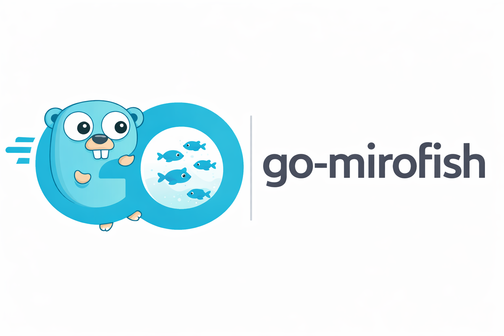

<div align="center">



**go-mirofish, lightweight and local-first**

[](https://github.com/go-mirofish/go-mirofish/stargazers)
[](./LICENSE)
[](https://go.dev/)
[](https://www.python.org/)
[](https://github.com/sponsors/go-mirofish)
[](https://www.buymeacoffee.com/justinedevs)
[](https://x.com/trader2g)

</div>

Upload documents, describe what you want to predict, and get a full simulation report **on your laptop**.

**Production site:** [go.mirofish.ai](https://go.mirofish.ai)

> [!NOTE]
> **go-mirofish** is a lightweight fork of [MiroFish](https://github.com/666ghj/MiroFish). The AI features and five-step workflow are the same; **only the web and runtime layer** is optimized for local-first, lower-overhead deployment.

## What changed vs MiroFish

| | MiroFish | go-mirofish |
| --- | --- | --- |
| RAM usage | ~500MB–1GB typical | ~350–600MB target |
| Startup | ~5–10s typical | ~1–2s target (hybrid stack) |
| Hardware | 8GB+ RAM comfortable | 4GB+ RAM target |
| Setup | Multi-step dev stack | **One command** (`./start.sh`) on the roadmap; Docker or npm today |

> [!NOTE]
> Targets above depend on workload, model choice, and simulation size. See [Installation](docs/getting-started/installation.md) for what works **today** in this repository.

## Quick start

**Goal:** running UI + API on a fresh machine in a few minutes.

1. **Clone**

   ```bash
   git clone https://github.com/go-mirofish/go-mirofish.git
   cd go-mirofish
   ```

2. **Configure**

   ```bash
   cp .env.example .env
   ```

   Edit `.env` and set at least **`LLM_API_KEY`** and **`ZEP_API_KEY`**.

3. **Run** (pick one)

   ```bash
   docker compose up -d
   ```

   **Or** from source (Node 18+ and **Python 3.11.x**; [uv](https://docs.astral.sh/uv/) is optional; see [Installation](docs/getting-started/installation.md#python-uv-and-venv)):

   ```bash
   npm run setup:all && npm run dev
   ```

   - App UI: [http://localhost:3000](http://localhost:3000)
   - API: [http://localhost:5001](http://localhost:5001)

> [!IMPORTANT]
> You need **`LLM_API_KEY`** and **`ZEP_API_KEY`** for the default cloud path. For **local LLMs** or other OpenAI-compatible providers, see [Ollama setup](docs/configuration/ollama.md) and [OpenAI-compatible providers](docs/configuration/providers.md).

> [!NOTE]
> This fork now includes additive hybrid entrypoints:
> - **`compose.yaml`** for the gateway + backend container topology
> - **`./start.sh`** / **`start.bat`** for the local prebuilt-gateway path
>
> Build the gateway binary into **`gateway/bin/`** first, then use the hybrid path described in [Installation](docs/getting-started/installation.md).

## How it works (5 steps)

1. **Graph building:** upload seed documents; build the knowledge graph  
2. **Environment setup:** extract entities, personas, and agent configuration  
3. **Simulation:** run the multi-agent social simulation  
4. **Report generation:** produce an analysis report from the simulated world  
5. **Deep interaction:** chat with agents and the report assistant  

## Showcase Proof

Current first-party benchmark result:

- backend boot: pass
- gateway boot: pass
- bounded stress pass: pass
- full benchmark flow: in progress but not fully green yet

Latest measured stress numbers:

- requests: `80`
- successes: `80`
- failures: `0`
- latency p50: about `4-5ms`
- latency p95: about `24-25ms`

Latest end-to-end benchmark status:

- ontology generation: pass
- graph build: pass
- deeper runtime phases are now reachable under the corrected Gemini/OpenAI-compatible configuration
- the remaining failures are no longer endpoint/model wiring failures; they are downstream execution issues in the long-running benchmark path

Supporting proof surfaces in this repo:

- benchmark fixture and harness
- contract verification
- gateway tests
- hybrid startup verification
- the current status of first-party screenshots and demo capture

## Production Split

- Docs / landing / showcase: static
- Interactive playground: fixture-driven and precomputed, with no shared live inference
- Real product: local / self-hosted
- Optional advanced mode: BYOK

The homepage now follows that split:

- public visitors get a zero-cost static playground replay
- real runs happen only after connecting a local backend
- advanced users can point the backend at their own provider keys or local OpenAI-compatible models

## Go Migration

Current state:

- Go owns the gateway and parts of the runtime/deployment surface
- Python still owns the core engine and most business logic

## Hardware compatibility

| Device | RAM | Works? |
| --- | ---: | --- |
| Desktop / laptop | 8GB | Yes |
| Desktop / laptop | 4GB | Yes (smaller simulations) |
| Raspberry Pi 5 | 4GB | ARM64-ready; pending on-device validation |
| Raspberry Pi 4 | 4GB | ARM64-ready; likely tight headroom, pending on-device validation |

> [!WARNING]
> Large graphs, long simulations, or heavy models can exceed **4GB** systems. Start with short runs and smaller seeds.

> [!NOTE]
> Hardware and runtime claims should be read together with the inline benchmark summary above, the detailed report in [docs/hybrid/benchmark-report.md](./docs/hybrid/benchmark-report.md), and the validation policy in [docs/hybrid/raspberry-pi-validation.md](./docs/hybrid/raspberry-pi-validation.md).

## Contributing

Issues and PRs are welcome. Use this repo for **go-mirofish** changes; upstream product discussion stays with [MiroFish](https://github.com/666ghj/MiroFish). Start with **[CONTRIBUTING.md](CONTRIBUTING.md)** and **[docs/contributing/README.md](docs/contributing/README.md)** (6-layer PR planning, Husky, Commitlint, Changesets, Renovate). Longer guides and the Phase 1–6 roadmap will also live on **[go.mirofish.ai](https://go.mirofish.ai)** as the docs site grows.

## License

[AGPL-3.0](./LICENSE).

## Acknowledgments

Derived from **[MiroFish](https://github.com/666ghj/MiroFish)**. Simulation is powered by **[OASIS](https://github.com/camel-ai/oasis)**. Thanks to the CAMEL-AI team.
