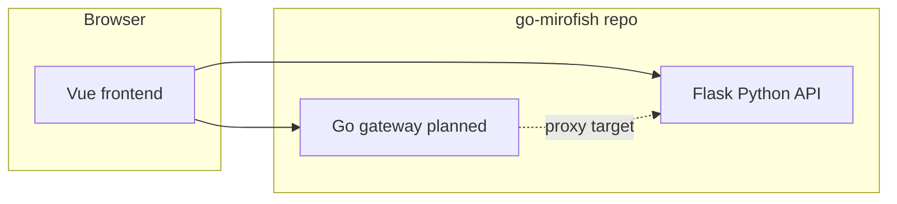

# 6-Layer Planning for Pull Requests (go-mirofish)

This guide is the **long-form narrative** for the same six-layer structure embedded in [`.github/PULL_REQUEST_TEMPLATE.md`](../../.github/PULL_REQUEST_TEMPLATE.md). Use it when planning or reviewing **pull requests** in **go-mirofish**. It is aligned to this repository’s layout, migration phases, and contribution model.

**GitHub templates:** **Issues** (bugs, ideas, tasks) use the chooser under [`.github/ISSUE_TEMPLATE/`](../../.github/ISSUE_TEMPLATE/) per [GitHub Docs](https://docs.github.com/en/communities/using-templates-to-encourage-useful-issues-and-pull-requests/about-issue-and-pull-request-templates). **Pull requests** use the six-layer body in [`.github/PULL_REQUEST_TEMPLATE.md`](../../.github/PULL_REQUEST_TEMPLATE.md); this file expands each layer for reading and workshops.

---

## Overview

Substantive **PRs** should make intent, constraints, design, execution, and quality explicit across six layers. Use it for **features**, **bugs**, **chores**, and **epics** that touch product behavior, the hybrid stack, contracts, or release gates.

---

## Layer 1: Intent parsing

**What needs to be done?**

Before starting work, define intent and scope clearly.

**Task title**

> Use a clear, descriptive title (imperative or outcome-focused).

**Primary goal**

> What problem are we solving? What user or maintainer outcome do we want?

**User story / context**

> As a [researcher / developer / operator], I want [capability] so that [benefit].

**Impact**

> Effect on users, local-first goals, upstream parity, docs, or maintenance.

**Task metadata**

| Field | Guidance |
| --- | --- |
| **Sprint / iteration** | Current cycle or `TBD` |
| **Related epic** | Link parent issue or roadmap discussion |
| **Issue type** | `Feature` / `Bug` / `Chore` / `Docs` / `Epic` |
| **Area** | One or more: `gateway-go`, `backend-python`, `frontend`, `contracts-parity`, `benchmark-ci`, `docker-infra`, `docs`, `upstream-sync`, `security`, `release` |
| **Migration phase** | If applicable: `phase-1` … `phase-6` (see repo roadmap / maintainer milestones) |
| **Upstream** | If relevant: link or note **MiroFish** (`666ghj/MiroFish`) behavior being preserved or synced |

**Project board (recommended)**

- Add the issue to the **go-mirofish GitHub Project** used for phase tracking (maintainers publish the project link in repo docs or pinned issue).
- Use labels such as **`phase:N`**, **`area:*`**, **`type:*`** consistent with that board.

**Contributor actions**

- Fill metadata accurately.
- Make the goal measurable where possible.
- Link related issues, PRs, and discussion threads.

---

## Layer 2: Knowledge retrieval

**What information do I need?**

**Required skills / knowledge**

- [ ] e.g. Go (gateway), Python/Flask, Vue/Vite, Docker, API contract testing, CI
- [ ] Gaps to close (docs, pairing, spike)

**Estimated effort**

> **S** (about 1–2 days) / **M** (about 3–5 days) / **L** (about 1+ weeks) — rough, for planning only.

**Knowledge resources (check as you go)**

- [ ] [README](../../README.md) and [Installation](../getting-started/installation.md)
- [ ] [Configuration](../configuration/) (e.g. [Ollama](../configuration/ollama.md))
- [ ] Root [`.env.example`](../../.env.example) and backend config behavior (do not rename env vars without an explicit decision)
- [ ] Backend entrypoints: `backend/app/api/`, `backend/app/services/`
- [ ] Frontend API clients: `frontend/src/api/`
- [ ] `docker-compose.yml`, `package.json` scripts
- [ ] Maintainer-owned planning artifacts (if available in your environment): hybrid migration PRD / test spec / deep-interview spec — use as **requirements** only when the issue explicitly references them

**Architecture context**

Include a short narrative or diagram when it helps.

*(Replace with a diagram that matches the issue — e.g. gateway-first vs current Flask-only.)*

**Code / pattern pointers**

> Point to existing files (relative to repo root), for example:
> - `frontend/src/` — UI and client calls  
> - `backend/app/` — APIs, services, simulation, reports  
> - future `gateway/` — Go public entry (when present)

**Contributor actions**

- Check off resources as reviewed.
- Note surprises in issue comments.
- Ask questions early if contracts or upstream parity are unclear.

---

## Layer 3: Constraint analysis

**What blocks or limits the work?**

**Dependencies**

- [ ] Issues or PRs that must land first (or write **None**)
- [ ] External services (LLM, Zep, hosting) if applicable
- [ ] Upstream MiroFish merge / parity work if applicable

**Technical constraints**

> Performance, compatibility, AGPL obligations, API schema parity, `.env` / config stability, protected Python boundaries (when issue touches core AI paths), resource targets (e.g. Pi-class deployment goals), etc.

**Blockers**

> Start with **None identified**. Update as work proceeds.

**Risks and mitigations**

> e.g. contract drift, multipart/proxy bugs, flaky simulation — with concrete mitigations (tests, feature flags, phased rollout).

**Resource constraints**

- **Deadline**: date or `TBD`
- **Effort**: S / M / L (align with Layer 2)

**Contributor actions**

- Be explicit about dependencies and blockers.
- Escalate early if scope or parity is at risk.

---

## Layer 4: Solution generation

**How should this be implemented?**

**Approach**

> High-level design, patterns, tradeoffs, and alternatives considered. For gateway or contract work, state how **public API parity** and **frontend callers** stay satisfied.

**Design checklist**

- [ ] Fits **additive-first** preference for fork maintenance (prefer new files / overlays when possible)
- [ ] Consistent with existing code style and structure
- [ ] Error handling and user-visible messages considered
- [ ] Tests or verification steps identified
- [ ] Security and secrets handling (no committed keys)
- [ ] Observability where relevant (logs, health checks)

**Acceptance criteria**

- [ ] Criterion 1 — specific, testable
- [ ] Criterion 2
- [ ] Criterion 3
- [ ] Docs or README updated if user-facing behavior changes
- [ ] Additional criteria for this issue…

**Contributor actions**

- Get agreement on approach for large or risky changes.
- Keep criteria measurable; update if scope changes.

---

## Layer 5: Execution planning

**What are the concrete steps?**

**Implementation steps**

1. [ ] Spike / clarify contracts or UX (if needed)
2. [ ] Implement change (smallest vertical slice)
3. [ ] Add or update tests, scripts, or manual verification checklist
4. [ ] Run local verification (`npm run dev`, Docker, or documented path)
5. [ ] Update docs (`docs/`, `README.md`) if behavior or setup changes
6. [ ] Open PR; link this issue; respond to review
7. [ ] Merge after approval and green CI

Adjust steps to the issue — fewer for docs-only fixes.

**Repository layout (this monorepo)**

| Path | Role |
| --- | --- |
| `frontend/` | Vue/Vite UI |
| `backend/` | Python Flask app and simulation stack |
| `gateway/` | Go gateway (when introduced) |
| `docs/` | User and contributor documentation |
| Root `package.json`, `docker-compose.yml` | Dev and container orchestration |

**Environment**

- Copy [`.env.example`](../../.env.example) to `.env`.
- Typical vars: `LLM_API_KEY`, `LLM_BASE_URL`, `LLM_MODEL_NAME`, `ZEP_API_KEY`, optional `LLM_BOOST_*` (omit unused boost keys entirely).

**Contributor actions**

- Check off steps in the issue body or comments.
- Link PRs early.

---

## Layer 6: Output formatting and validation

**How do we ensure quality?**

**Ownership**

- **Owner**: @assignee — implementation lead  
- **Reviewer**: @reviewer — assigned at review time  
- **Maintainer contact**: @JustineDevs (adjust if org adds co-maintainers)  
- **Deadline**: date or `TBD`  
- **Communication**: GitHub issue comments (primary); [Discord](http://discord.gg/ePf5aPaHnA) for quick questions if the team uses it

**Quality gates**

- [ ] Change matches issue acceptance criteria
- [ ] **CI** green for the repo (e.g. GitHub Actions workflows that apply)
- [ ] **Lint / tests**: run project-standard checks; add tests when logic changes (coverage targets are not globally mandated — follow review feedback)
- [ ] No secrets committed  
- [ ] User-facing docs updated when behavior or setup changes  
- [ ] Breaking API or contract changes called out explicitly and approved  

**Review checklist**

- [ ] At least one reviewer approved (per branch protection)
- [ ] Parity / regression considerations addressed for API or gateway changes
- [ ] Rollback or migration notes if deploy order matters

**Delivery**

- **Status**: To do → In progress → In review → Done  
- **PRs**: link all related PRs  
- **Sign-off**: maintainer approval recorded in issue or PR

**Contributor actions**

- Check gates before requesting final review.
- Keep the PR description updated through merge.

---

## How to use this template

### PR authors & issue creators

1. Open **PRs** with [`.github/PULL_REQUEST_TEMPLATE.md`](../../.github/PULL_REQUEST_TEMPLATE.md); use this doc for detail. For **new issues** (before a PR), pick a template under [`.github/ISSUE_TEMPLATE/`](../../.github/ISSUE_TEMPLATE/)—or copy sections from this doc.
2. Fill every layer with enough detail that someone unfamiliar with the thread can execute.
3. Add labels, project, milestone, and links.
4. Avoid scope creep without updating Layers 1, 3, and 4.

### Contributors

1. Read all layers before coding.
2. Update Layer 3 blockers and Layer 5 checkboxes as you go.
3. Comment with findings, especially for contract or upstream parity.

### Reviewers

1. Confirm Layers 4–6 align with what was shipped.
2. Verify acceptance criteria and quality gates.
3. Approve when satisfied; request changes with specifics.

---

## Best practices

**Do**

- Be specific; link paths and prior art.
- Update the PR / linked issue when you learn something new.
- Prefer small PRs that close a slice of an epic.

**Don’t**

- Skip constraint or acceptance discussion for risky changes.
- Change public API shapes or `.env` names without an explicit decision.
- Merge without review or with failing checks.

---

## Getting help

- Open a **GitHub issue** with the Layer 1 summary filled in.
- **Discord**: [Join the server](http://discord.gg/ePf5aPaHnA) (see [README](../../README.md)).
- **Upstream behavior**: compare with [MiroFish](https://github.com/666ghj/MiroFish) when parity matters.

For a short link from the README **Contributing** section, use:  
`docs/contributing/github-pr-6-layer.md`.
